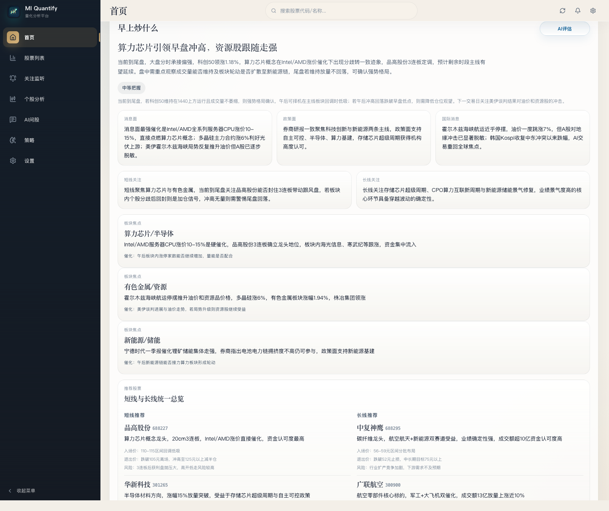
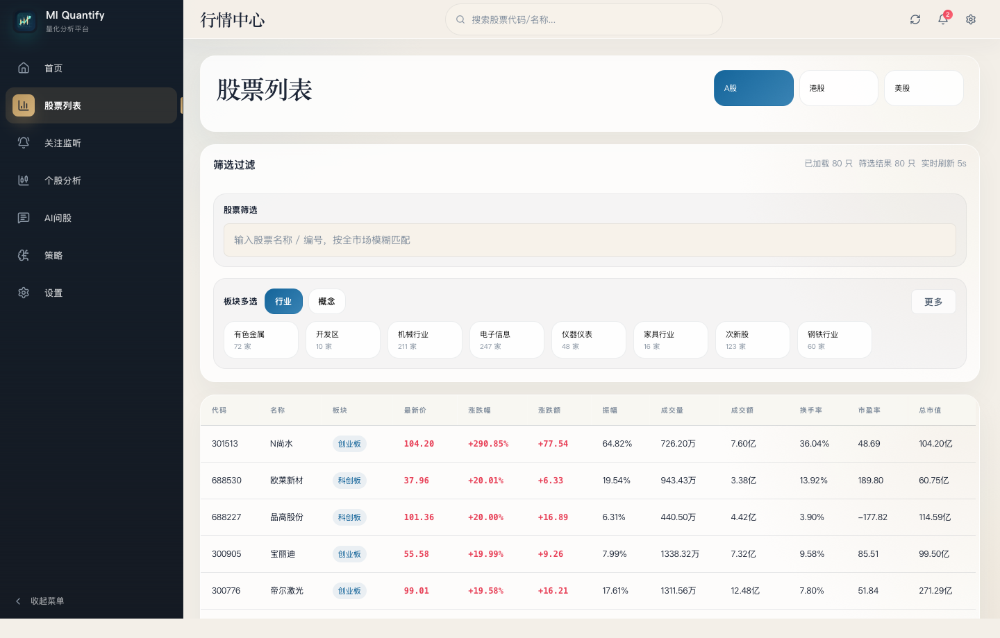
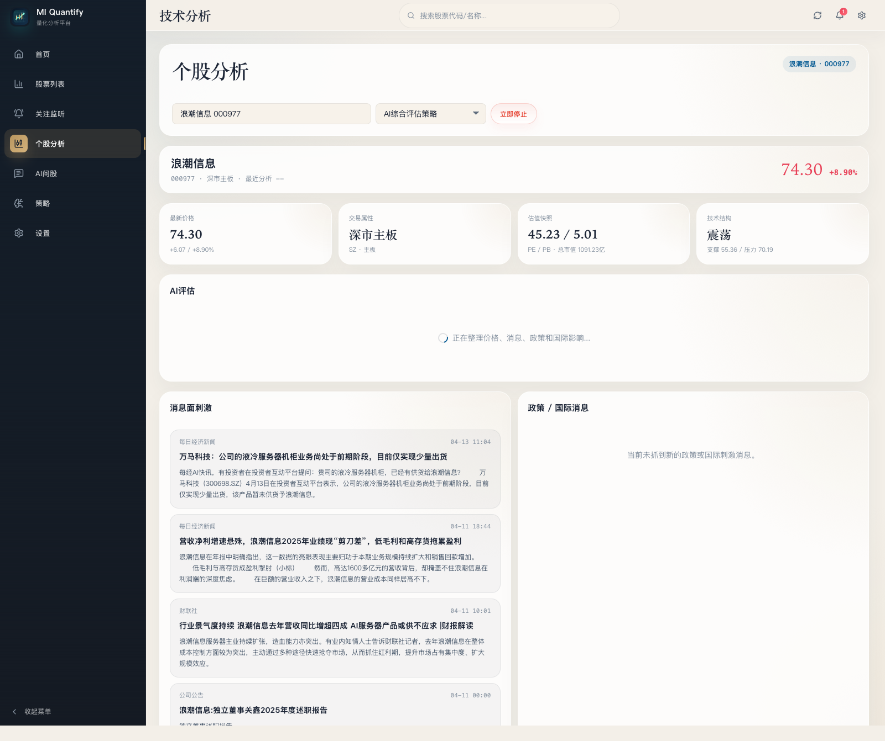
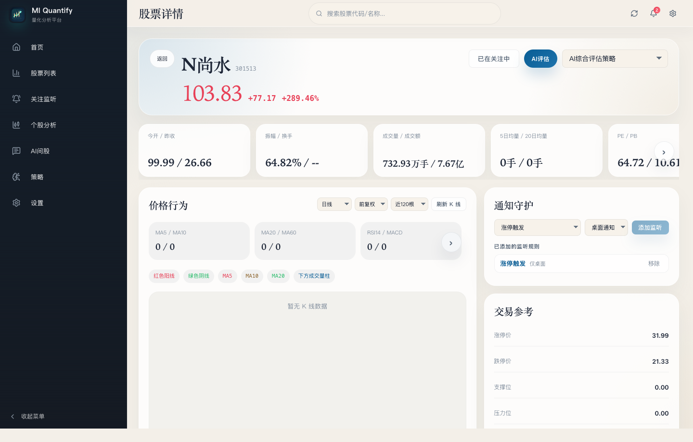
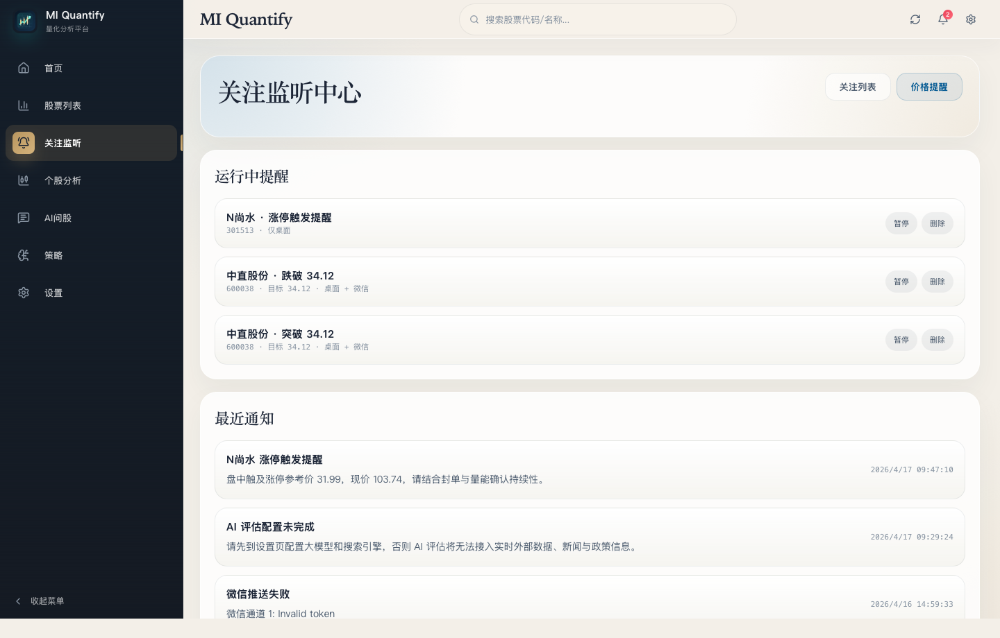
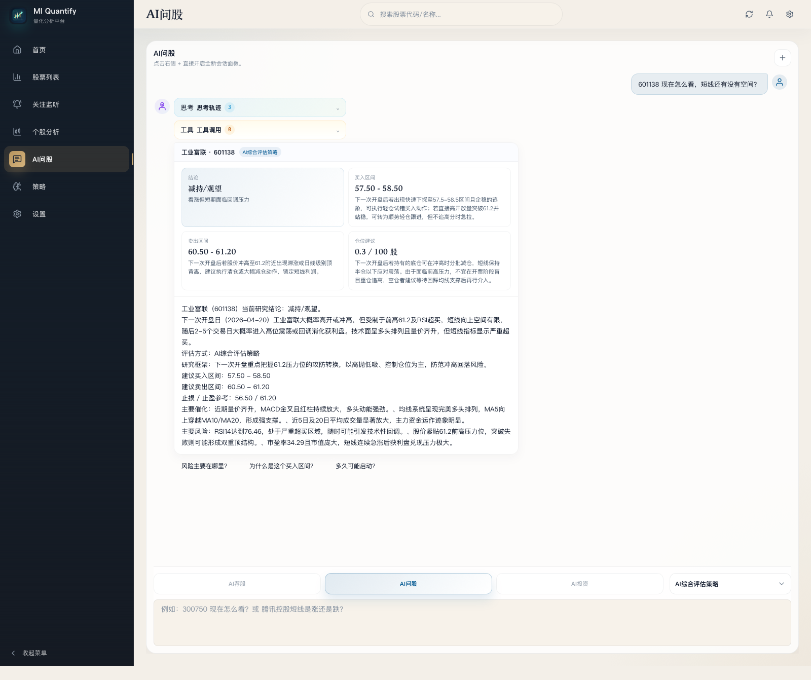
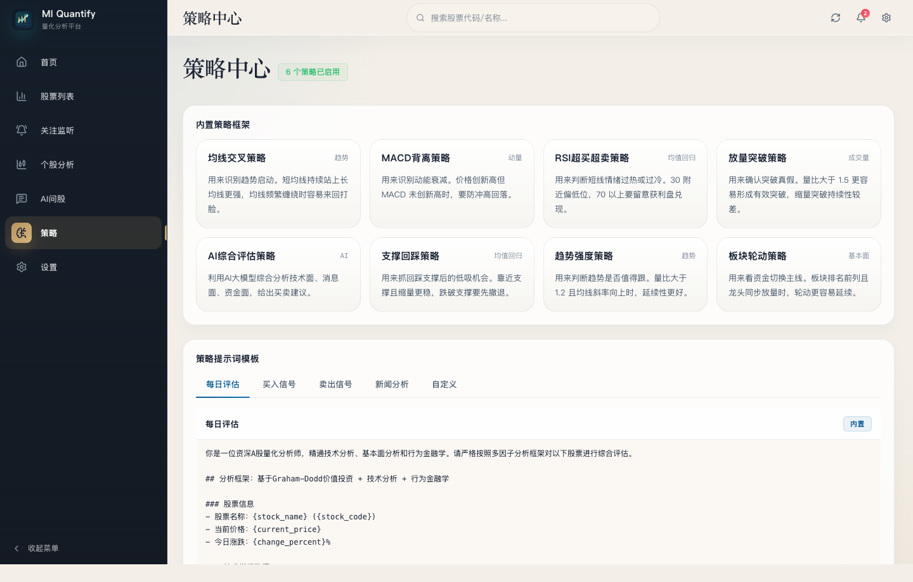
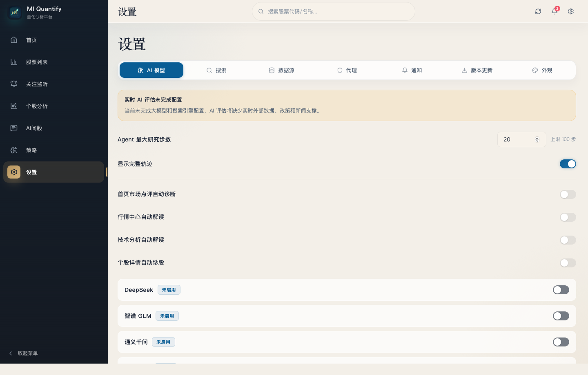

# MI Quantify

MI Quantify 是一个面向个人研究者与主动交易场景的 AI 股票研究工作台。它把桌面端交互、实时行情、个股跟踪、事件驱动提醒、策略管理和大模型分析整合到同一个 Tauri 应用里，目标不是做一个“只会展示行情的看板”，而是把盘前准备、盘中观察、盘后复盘放进一条连续工作流。

项目当前采用 `Tauri 2 + Vue 3 + TypeScript + Pinia + Python FastAPI sidecar` 架构，前端负责多页面研究体验与本地状态管理，Python sidecar 负责行情、新闻、板块、财务等数据聚合，Rust/Tauri 负责桌面能力、持久化、通知、任务调度与更新分发。

> 适用于研究辅助与决策支持，不构成投资建议，也不承诺收益。

## 为什么是桌面研究工作台

- 不把行情、资讯、提醒、AI 问答拆散到多个网页和机器人里。
- 不依赖单一数据源，支持 sidecar 聚合免费源，也保留远程搜索和可切换 AI 提供商。
- 不只做“问答”，而是围绕研究动作设计：看市场、选股票、跟踪标的、加提醒、复盘策略、接入外部通知。
- 不只适合 A 股，内置 A 股、港股、美股三类市场视角。

## 功能全景

### 1. 首页总览

- 聚合指数、市场温度、热点均值、成交脉冲、主线板块、政策导向、社会面等核心指标。
- `早上炒什么` 会直接给出 AI 盘面结论、消息面、政策面、国际消息、短线与长线关注方向。
- 同一页内联动 `AI政策导向` 与 `AI未来市场预期`，把盘中该看什么、后面该盯什么放到一组评估工作流里。
- 首页不是静态卡片，而是一个实时市场驾驶舱。



### 2. 行情中心

- 支持 A 股、港股、美股切换。
- 提供全市场股票列表、板块过滤、模糊搜索、分页与自动刷新。
- 列表字段覆盖价格、涨跌幅、振幅、成交量、成交额、换手率、市盈率、总市值等交易所需核心因子。
- 板块标签可直接把研究从“单只股票”拉回“资金在做哪条主线”。



### 3. 个股 AI 评估

- 输入股票名称或代码后，可直接选择策略并触发 `AI综合评估策略`。
- 评估结果会把价格位置、估值快照、技术结构、利多线索、风险与影响拆成独立模块，而不是只给一段结论文本。
- 适合在盘中快速判断一只票当前该追、该等还是该减仓，并保留后续继续扩展为更完整研究路径的空间。



### 4. 个股详情与研究面板

- 单只股票页面整合了报价、盘口五档、估值、新闻、研究提醒和 AI 诊股入口。
- 支持从个股页一键加入关注列表，并直接配置涨停、开板、突破价、跌破价等提醒规则。
- K 线区预留多周期、复权方式和样本范围切换，适合扩展成更完整的技术分析面板。
- 资讯区同时拉取个股新闻与市场消息，方便把技术面和事件面放在同一个上下文里理解。



### 5. 关注监听中心

- 关注列表会持久化存储，重新打开应用后仍能恢复研究池。
- 价格提醒与板块事件提醒分开管理，既适合做重点标的跟踪，也适合做盘中触发观察。
- 最近通知面板保留提醒历史，可配合桌面通知或外部通道回看触发结果。
- 这是从“看盘”走向“监控盘面”的关键模块。



### 6. AI 问股

- 提供多轮对话入口，而不是一次性 prompt 输入框。
- 问答模式和荐股模式共存，适合“我想问这只票怎么看”与“我想找某类机会”两类任务。
- 会话支持本地持久化，便于盘中延续研究上下文。
- 问股结果会同时给出结论、买入区间、卖出区间、仓位建议、风险追问入口，适合做连续追问而不是一次性出报告。
- 底层已经接入诊断 Agent、推荐 Agent、提示词模板与策略选择器，具备继续向更强 Agent 工作流扩展的基础。



### 7. 策略中心

- 内置趋势、均值回归、动量、成交量、形态、基本面、AI 等多类别策略。
- 支持启用/停用策略、查看策略摘要、编辑提示词模板、自定义策略。
- 默认附带 mock 信号与内置 prompt 模板，方便在没有完整 AI 配置的情况下先搭建研究框架。
- 适合把“经验判断”逐步沉淀成统一的策略库和分析提示词资产。



### 8. 设置与集成

- 内置多家 AI 提供商预设：DeepSeek、智谱 GLM、通义千问、ChatGPT、豆包、Kimi、自定义。
- 内置多家搜索提供商预设：智谱 Web Search、SearXNG、YaCy、Brave、Tavily、SerpApi、Serper、Exa、自定义。
- 数据源配置支持 sidecar 聚合源与远程源的混合模式。
- 支持代理、通知、自动更新、外观设置，以及 OpenClaw 通道配置。



## 这个仓库已经覆盖的能力

### 市场研究

- 首页市场总览与多市场切换
- 指数、个股列表、热点股、板块热度、新闻脉冲
- 个股详情、盘口深度、财务与资讯补充

### 交易观察

- 自选股/关注池持久化
- 价格突破/跌破提醒
- 涨停、开板、回封、跌停等事件提醒
- 最近通知与触发历史

### AI 能力

- 首页 AI 市场评估（`早上炒什么` / `AI政策导向` / `AI未来市场预期`）
- 个股 AI 评估与策略切换
- AI 诊股入口
- AI 问股与荐股双模式
- 大模型供应商切换
- 搜索引擎切换
- 提示词模板管理
- Agent 最大研究步数、轨迹可视化、页面级自动诊断开关

### 策略资产

- 内置策略库
- 自定义策略
- 提示词模板编辑
- 信号与评估结果持久化

### 桌面能力

- Tauri 原生桌面壳
- 本地存储与本地数据库持久化
- 桌面通知
- 自动更新
- 外部通知通道接入基础能力

## 技术架构

```text
┌────────────────────────────────────────────────────────┐
│ Tauri Desktop Shell                                   │
│  ├─ Window / updater / notification / local commands  │
│  └─ Rust commands: monitor / scheduler / wechat / AI  │
├────────────────────────────────────────────────────────┤
│ Vue 3 Frontend                                        │
│  ├─ Home / Market / Monitor / Analysis / Ask / Strategy / Settings │
│  ├─ Pinia stores                                      │
│  ├─ AI agents & prompt templates                      │
│  └─ Realtime polling / workflow orchestration         │
├────────────────────────────────────────────────────────┤
│ Python Sidecar (FastAPI)                              │
│  ├─ market / kline / sector / news / finance routers  │
│  ├─ AkShare / BaoStock / 新浪 / 东方财富 / RSS 聚合     │
│  └─ local HTTP service on 127.0.0.1:18911             │
└────────────────────────────────────────────────────────┘
```

## 数据与集成策略

### 默认数据聚合

- 本地 sidecar 聚合 `AkShare`、`BaoStock`、新浪、东方财富等免费数据源。
- 远程 RSS/搜索源补充国际新闻、政策事件与主题消息。
- 前端通过统一 sidecar API 访问市场数据，降低页面层面对外部网站结构变化的敏感度。

### AI 供应商策略

- 模型层不绑定单一厂商，默认通过设置页切换活动 Provider。
- 搜索层与模型层分离，保证“能回答”和“能检索实时外部信息”是两个独立能力。
- 适合把本地研究习惯和不同模型的长处拆开配置。

### 提醒与通知

- 本地提醒规则持久化到 Tauri 侧。
- 桌面通知可直接使用。
- 代码中已预留微信 / 企业微信 / Webhook 型通道接入能力，适合继续扩展到团队提醒或移动端推送。

## 快速开始

### 运行环境

- Node.js 22+
- pnpm 9+
- Rust stable
- Python 3.10+

### 1. 安装前端依赖

```bash
pnpm install
```

### 2. 安装 Python sidecar 依赖

推荐直接使用可编辑安装：

```bash
python -m pip install -e ./src-python
```

如果你使用 `uv`，也可以在 `src-python` 目录执行：

```bash
uv sync
```

### 3. 启动 sidecar

开发阶段建议先手动启动数据服务：

```bash
cd src-python
python run.py
```

启动后默认监听：

```text
http://127.0.0.1:18911
```

健康检查：

```bash
curl http://127.0.0.1:18911/health
```

### 4. 启动桌面应用

```bash
pnpm tauri dev
```

### 5. 仅启动前端 Web 调试

```bash
pnpm dev
```

## 构建

### Web 构建

```bash
pnpm build
```

### 桌面构建

```bash
pnpm tauri build
```

### 平台构建脚本

```bash
pnpm build:mac
pnpm build:mac-arm
pnpm build:mac-intel
pnpm build:windows
pnpm build:linux
```

## 项目结构

```text
.
├─ src/                  # Vue 前端页面、组件、stores、composables、agents
├─ src-tauri/            # Tauri / Rust 命令、窗口、更新、通知、打包配置
├─ src-python/           # FastAPI sidecar、数据路由、市场与新闻服务
├─ images/               # README 展示截图
└─ .github/workflows/    # CI、构建测试、Release 发布流水线
```

## CI / Release

- `CI` 工作流会执行前端类型检查、Web 构建和多平台桌面构建测试。
- `publish` 工作流会构建 sidecar、打包 Tauri 应用并生成 updater 所需产物。
- Release 流程已经覆盖 macOS、Windows、Linux 三个平台。

## 适合谁使用

- 想把“行情 + AI + 提醒 + 策略”整合到同一个桌面工具里的个人研究者
- 需要一个可以继续二次开发的量化研究前端壳
- 想基于 Tauri + Python sidecar 构建桌面投研产品的开发者

## 后续可以继续扩展的方向

- 更完整的回测与信号验证模块
- 策略信号回放与盘后归因
- 多账户、多工作区配置
- 更细粒度的消息源和宏观事件图谱
- 多终端同步与移动端提醒闭环

## 免责声明

本项目仅用于行情研究、信息聚合、策略整理与 AI 辅助分析，不构成任何投资建议。使用者应自行承担市场风险，并对接入的数据源、模型输出和通知结果进行独立验证。
